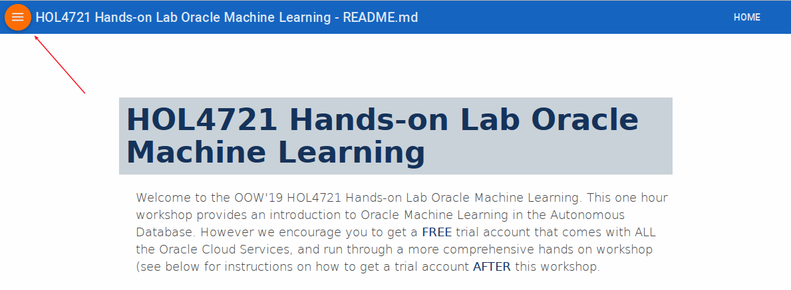
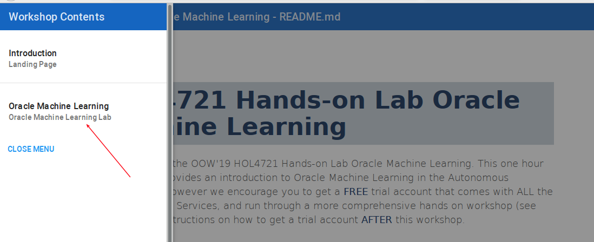

# ML 101: Oracle Data Miner/Oracle Autonomous Data Warehouse Cloud Lab Guide

Welcome to Analytics and Data Summit!  This two hour workshop provides an introduction to Oracle Machine Learning.  This is the lab guide for the hands on part of the workshop.  You have been provided with environments to complete these labs.  However we encourage you to get a **FREE** trial account that comes with ALL the Oracle Cloud Services, and run through a more comprehensive hands on workshop (see below for instructions on how to get a trial account **AFTER** this workshop.

## Presentation

**Click to Download**

[OOW 2018 Machine Learning HOL Presentation](https://dgcameron.github.io/adwcml_oow/OOW18-ML101-HOL5759.pptx)

## Navigate to Machine Learning Lab

- Once the setup is complete you can move on to the Machine Learning lab by clicking on the Menu Icon in the upper left corner of the browser window and then selecting Oracle Machine Learning. You're now ready to continue with the Machine Learning Lab.

 

## Acquire an Oracle Cloud Trial or Workshop Account (after this workshop)

Please click on the [Free Oracle Cloud Promotion](https://myservices.us.oraclecloud.com/mycloud/signup?language=en&sourceType=:ex:tb:::RC_NAMK180723P00029:RedshiftADWC_HOL&SC=:ex:tb:::RC_NAMK180723P00029:RedshiftADWC_HOL&pcode=NAMK180723P00029) link to complete all the required steps to get your free Oracle Cloud Trial Account. When you complete the registration process you'll receive a $300 credit and up to 3500 hours of free Oracle Cloud usage. You'll have 1000s of hours left over after the labs to continue to explore the Oracle Cloud.  Soon after requesting your trial you will receive the following email. You will not be able to start Lab 100 until you have received it.

**Suggested followup Autonomous Data Warehouse Workshop, with Oracle Machine Learning:**

https://go.oracle.com/adwc

