  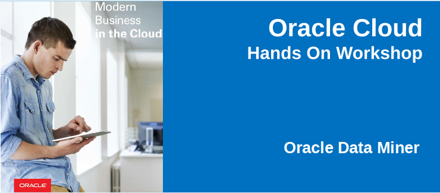

# Oracle Data Miner Lab

## **Introduction**
Estimated time to complete: 1 hour

This tutorial covers the use of Oracle Data Miner to perform data mining against Oracle Database 18c. In this lesson, you examine and solve a data mining business problem by using the Oracle Data Miner graphical user interface (GUI). The Oracle Data Miner GUI is included as an extension of Oracle SQL Developer, version 18.

Oracle SQL Developer is a free graphical tool for database development. With SQL Developer, you can browse database objects, run SQL statements and SQL scripts, and edit and debug PL/SQL statements. Starting with SQL Developer, version 18, you can also access the Oracle Data Miner GUI, which provides a tightly integrated interface to Oracle Data Mining features.

## **Overview**

Data mining is the process of extracting useful information from masses of data by extracting patterns and trends from the data. Data mining can be used to solve many kinds of business problems, including:
- Predict individual behavior, for example, the customers likely to respond to a promotional offer or the customers likely to buy a specific product (Classification)
- Find profiles of targeted people or items (Classification using Decision Trees)
- Find natural segments or clusters (Clustering)
- Identify factors more associated with a target attribute (Attribute Importance)
- Find co-occurring events or purchases (Associations, sometimes known as Market Basket Analysis)
- Find fraudulent or rare events (Anomaly Detection)

### **The phases of solving a business problem using Oracle Data Mining are as follows:**
1. Problem Definition in Terms of Data Mining and Business Goals
2. Data Acquisition and Preparation
3. Building and Evaluation of Models
4. Deployment

### **Problem Definition and Business Goals**

When performing data mining, the business problem must be well-defined and stated in terms of data mining functionality. For example, retail businesses, telephone companies, financial institutions, and other types of enterprises are interested in customer “churn” – that is, the act of a previously loyal customer in switching to a rival vendor.

The statement “I want to use data mining to solve my churn problem” is much too vague. From a business point of view, the reality is that it is much more difficult and costly to try to win a defected customer back than to prevent a disaffected customer from leaving; furthermore, you may not be interested in retaining a low-value customer. Thus, from a data mining point of view, the problem is to predict which customers are likely to churn with high probability, and also to predict which of those are potentially high-value customers.

### **Data Acquisition and Preparation**

A general rule of thumb in data mining is to gather as much information as possible about each individual, then let the data mining operations indicate any filtering of the data that might be beneficial. In particular, you should not eliminate some attribute because you think that it might not be important – let ODM’s algorithms make that decision. Moreover, since the goal is to build a profile of behavior that can be applied to any individual, you should eliminate specific identifiers such as name, street address, telephone number, etc. (however, attributes that indicate a general location without identifying a specific individual, such as Postal Code, may be helpful.)

It is generally agreed that the data gathering and preparation phase consumes more than 50% of the time and effort of a data mining project.

### **Building and Evaluation of Models**

The Workflow creation process of Oracle Data Miner automates many of the difficult tasks during the building and testing of models. It’s difficult to know in advance which algorithms will best solve the business problem, so normally several models are created and tested.

No model is perfect, and the search for the best predictive model is not necessarily a question of determining the model with the highest accuracy, but rather a question of determining the types of errors that are tolerable in view of the business goals.

### **Deployment**

Oracle Data Mining produces actionable results, but the results are not useful unless they can be placed into the correct hands quickly. The Oracle Data Miner user interface provides several options for publishing the results.

### **Scenario**

This lesson focuses on a business problem that can be solved by applying Classification models. In our scenario, ABC Company wants to identify customers who are most likely to purchase insurance.

Note: For the purposes of this tutorial, the "Data and Acquisition" phase has already been completed, and the sample data set contains all required data fields. Therefore, this lesson focuses primarily on the "Building and Evaluation of Models" phase.

## Instructions

### Log into Remote Global Desktop

- Use the [Remote Global Desktop Login](http://dma.oraclepts.nl/) to sign into a desktop that has everything you need for this lab.  Select login and use your assigned userid and password:  

  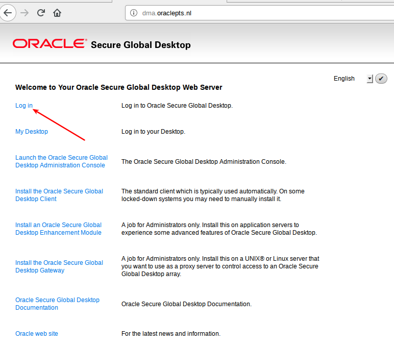

- Select `client options` (not a login just yet).

  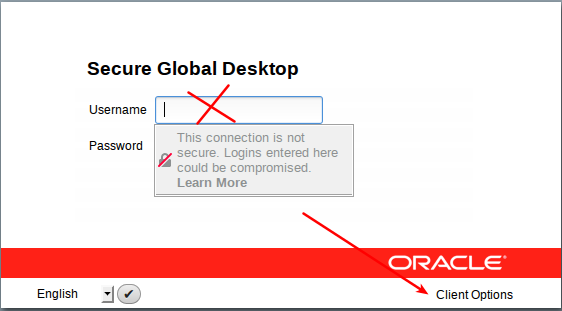

- Select `click here to login` under html 5:

  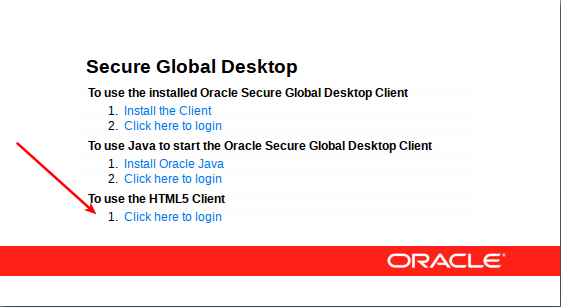

  - Enter your assigned username and password:

  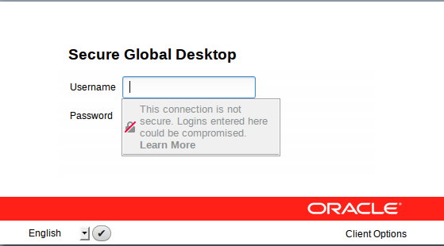

- You will end up here.  Click on the `X Desktop` icon.

  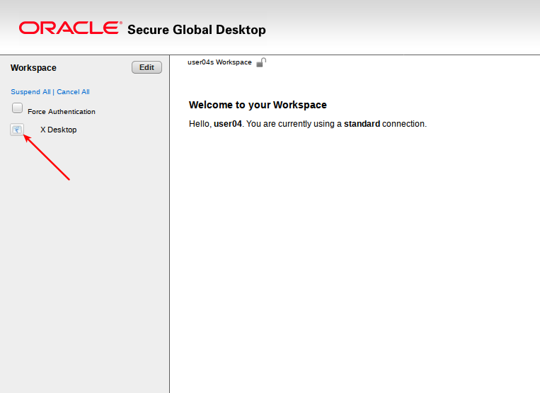

- You will end up on a desktop that looks like this.

  

- Start SQL Developer by double clicking on the desktop icon.

  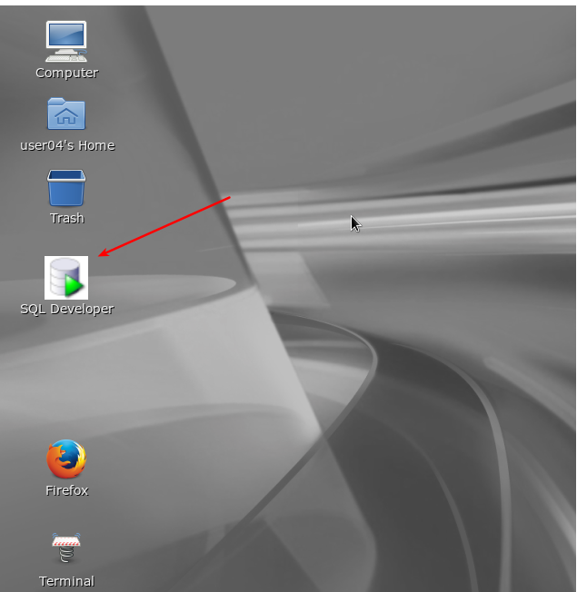

  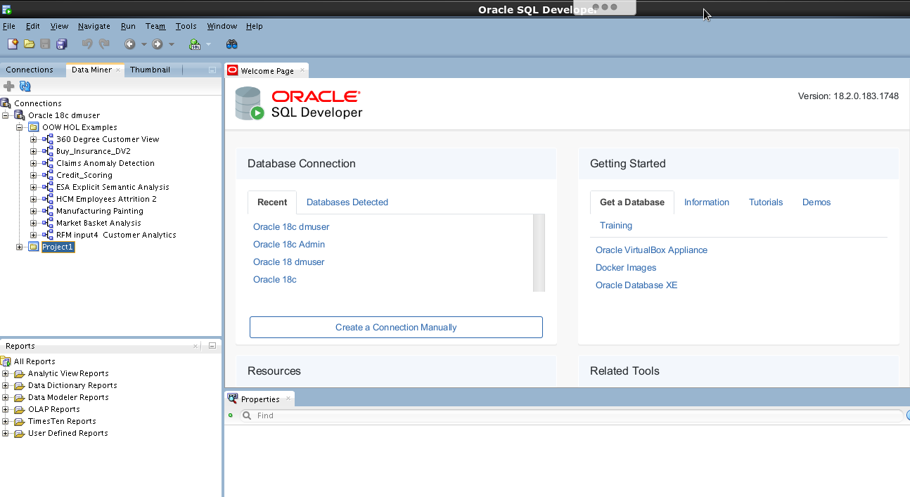

### Navigate to Oracle Data Miner Tutorials

- Open a browser and navigate to <a href="https://apexapps.oracle.com/pls/apex/f?p=44785:24:::NO::P24_CONTENT_ID,P24_PREV_PAGE:11925,2" target="_blank">Oracle Data Miner Tutorials</a>

  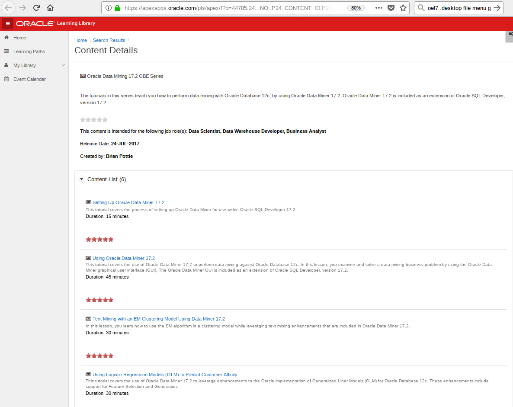

- There are 6 Tutorials.  The first tutorial is already done for you.  Proceed through the remaining tutorials.  You should be able to complete between three and five of the ones listed on this page.  Start with `Using Oracle Data Miner 17.2` and then move on to the others.
  - Using Oracle Data Miner 17.2
  - Star Schema Mining Using Oracle Data Miner 4.1
  - Text Mining with an EM Clustering Model Using Data Miner 17.2
  - Anomaly Detection (CLAIMS)  See Instructor for assistance
  - Market Basket Analysis (SH.SALES)  See Instructor for assistance

  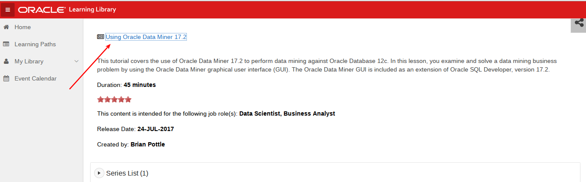

- Move on directly to `Create a Data Miner Project`.  There are two projects already - you can ignore these for now.

  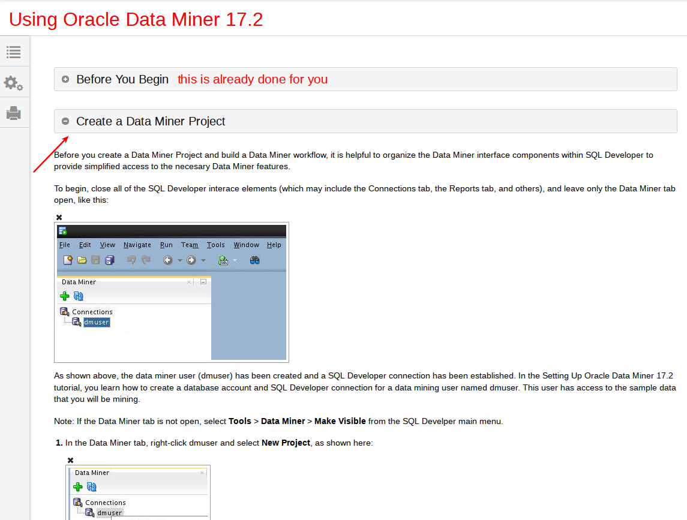
