  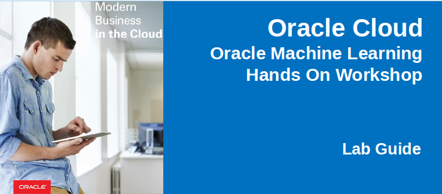

# Oracle Autonomous Data Warehouse Machine Learning Demo Lab

## Introduction
_Time to Complete: ~45 minutes

In this lab you will assume the persona of Heather, the data scientist/ML expert for Alphaoffice. Heather has spent most of her time over the past couple of years extracting and preparing data for analysis. The large volumes of data need extracting and processing mean she spends most of her time waiting for jobs to finish and very little of her time analyzing the data. Demands from marketing are forcing a new approach whereby the data remains in the data warehouse and is processed there. The alternative cloud solution is more complex, and has no direct out of the box processes to analyze the data in place. She started taking a look at Oracle, and found the simple SQL commands in ADWC are familiar, and execute extremely fast, leveraging all the performance features of the platform. Further once she is done can can apply the learning models to incoming data on the fly, and allow end user analysts to immediately see mining results. This drastically reduces the cycle of data preparation, analysis, and publishing. It also means there is no change to analysis/reporting Data Visualization toolset that users are familiar with.

An added benefit is the ability to use a new open source Apache Zeppelin based collaboration environment where she can work with others on the team in real time, annotating ML steps and combining the processing and documentation in one place. Since we are going to use Oracle ML interface, much of the lab will be done in that interface. For more information on which Machine Learning Algorithms are supported see Oracle Advanced Analytics documentation.

You will begin your machine learning development journey by importing an Apache Zeppelin Notebook into Oracle Machine Learning and then use ADWC's Machine Learning to predict customer good credit given detailed demographic information.

## Objectives

- Get hands-on with Oracle's Autonomous Data Warehouse Machine Learning
- Explore the Apache Zeppelin notebook interface
- Create an Attribute Importance Model using the DBMS_Predictive_Analytics.Expain procedure
- Identify customer attributes that are the best predictors of good credit
- Predict credit worthiness of new customers

## Instructions

### Download your workshop files.  Navigate to the menu top right and then select install.zip to download.  Extract this file once you have downloaded it.

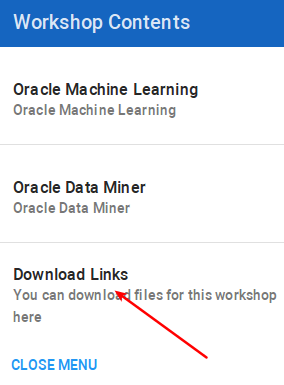

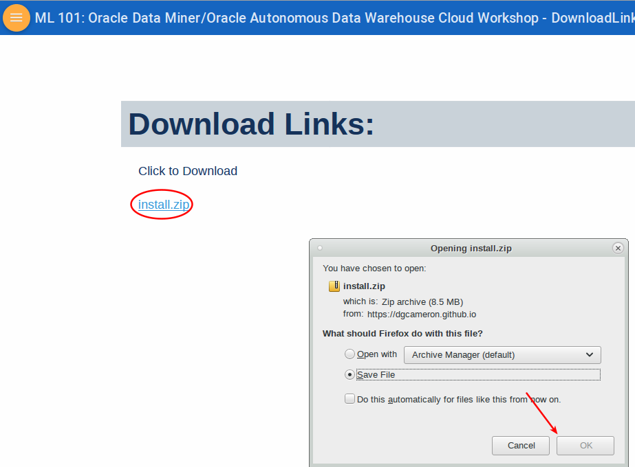

### Log into Oracle Machine Learning.

- To support this workshop we have pre-provisioned several Autonomous Data Warehouse instances, and have allocated userids user01 - user80.  Use your assigned login url and userid to sign into Machine Learning.  The password for everyone will be `OraclePTS2018#`.

  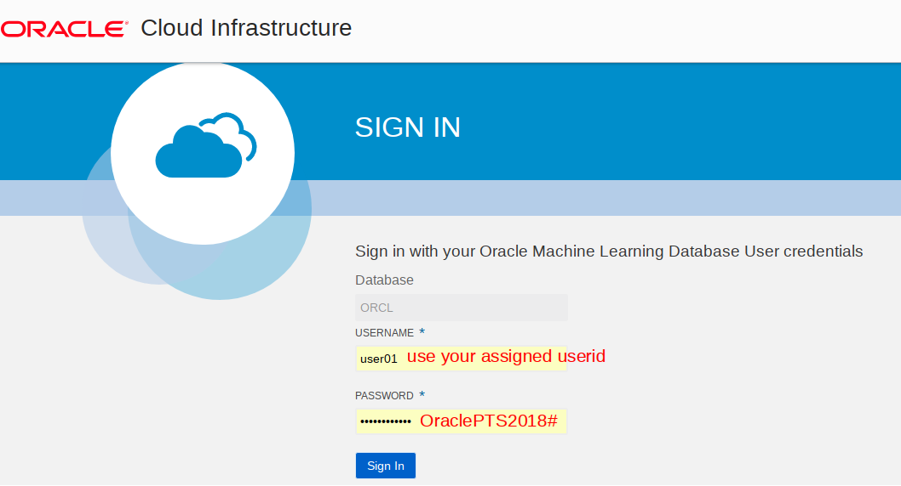

- Note that you can run sql statements, run sql scripts (pl/sql blocks), work with Apache Zeppelin Notebooks, schedule notebooks to run at specified times, and review examples of notebooks.  Note that the examples are review only.  To work with the examples you need to first export and then import them to be updatable.  Lets take a look at the examples.  Select `Examples` to review sample content.

  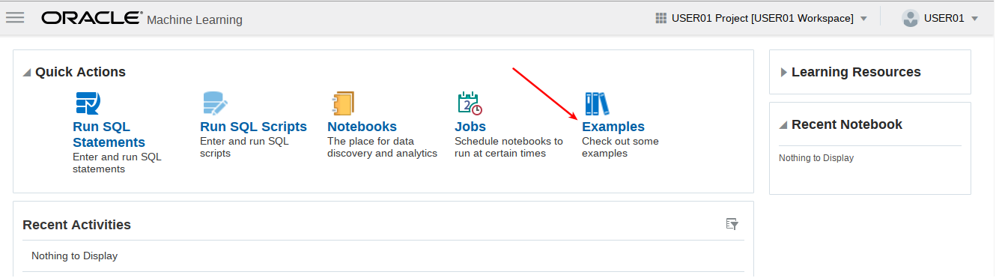

- Select `Attribute Importance` and review the notebook content.  We will not do anything with this notebook, but will be using the `Attribute Importance` model later on.

  

- When you first open a notebook you need to set the interpreter binding and save this setting.  This is only done once.  Any of the binding settings will work.  This is setting the resources (memory, low, medium, high).  Then scroll down to review the example content.

  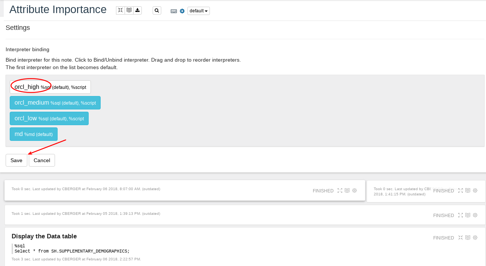

  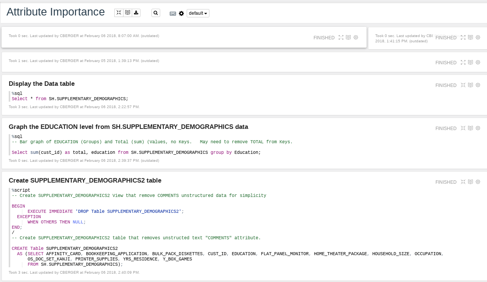

- Select the menu in the upper left and select `Notebooks`.

  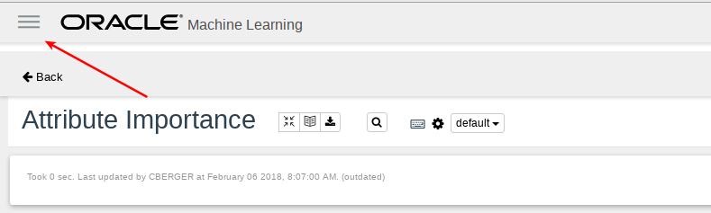

  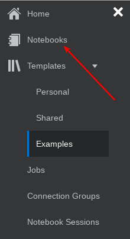

- We will be importing a pre-built notebook, and using this for the remainder of the lab.  Select `Import`.

  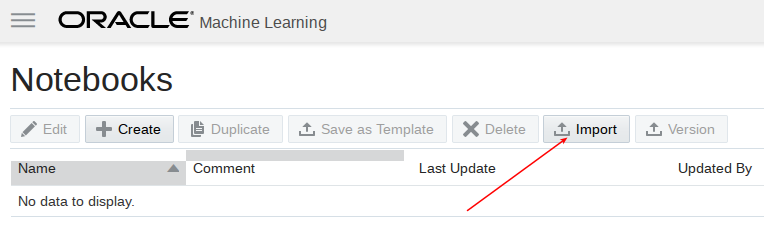

- Go to where you downloaded the `Credit Score Predictions.json` file and import the notebook.

  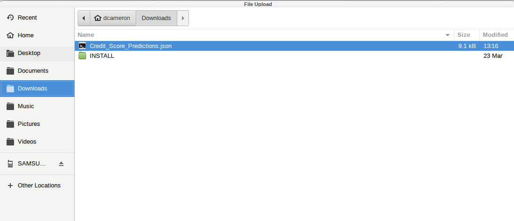

- Select the `Credit Score Predictions` notebook.

  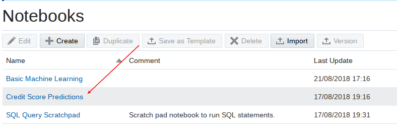

- Before you start working with the `Credit Score Predictions` you need to set the interpreter binding.  Click on the gear icon.

  

- Select the one of the interpreter bindings and then Save.

  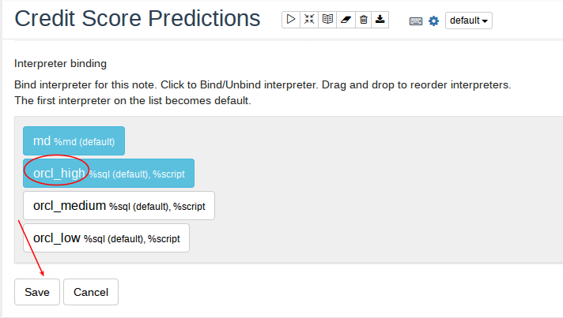

The rest of this lab will be done interactively in the notebook.  The following area just screen shots for your convenience.

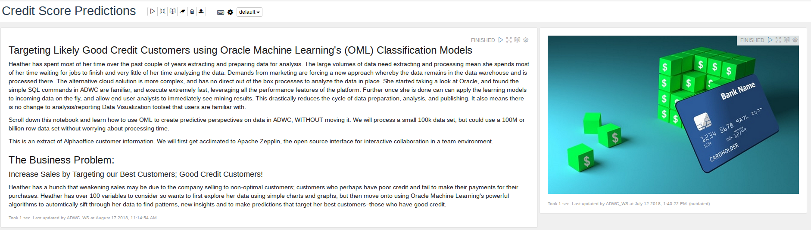

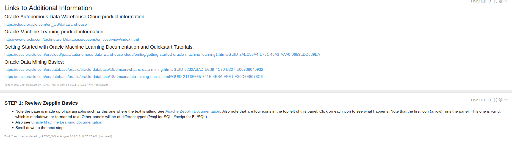

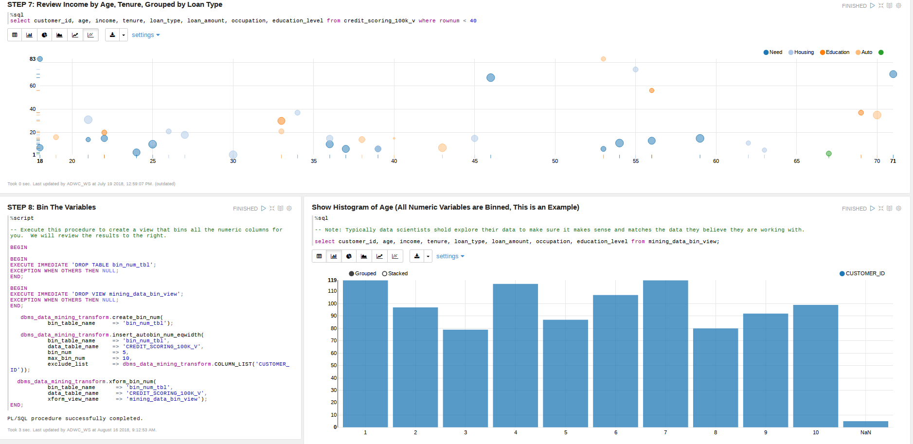

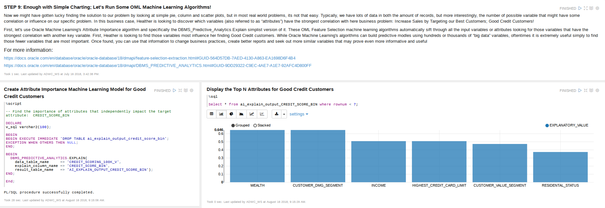

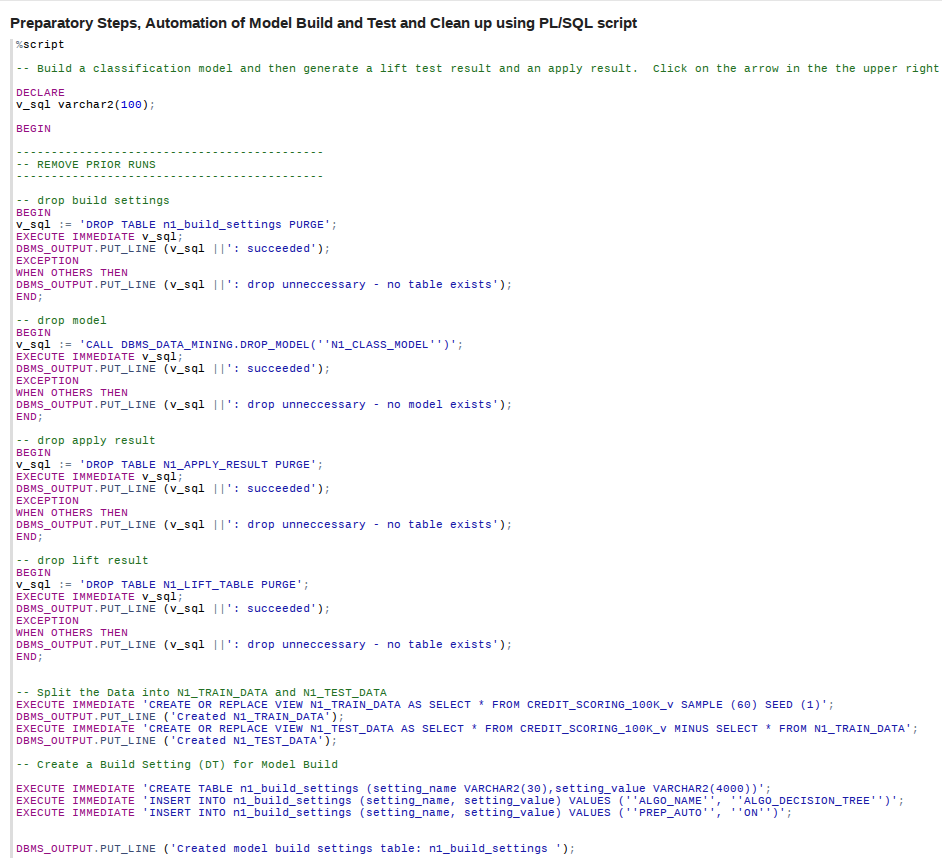

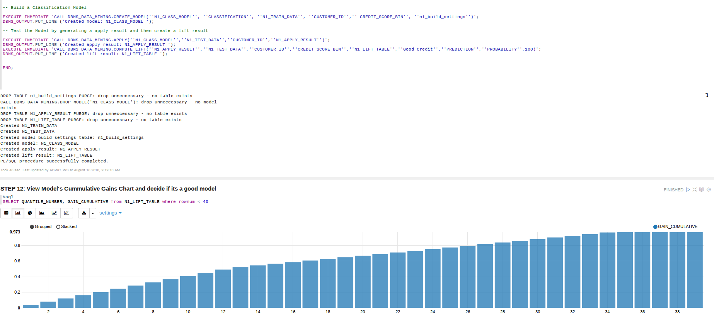

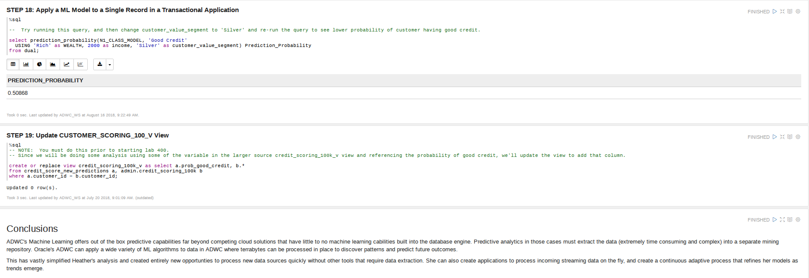